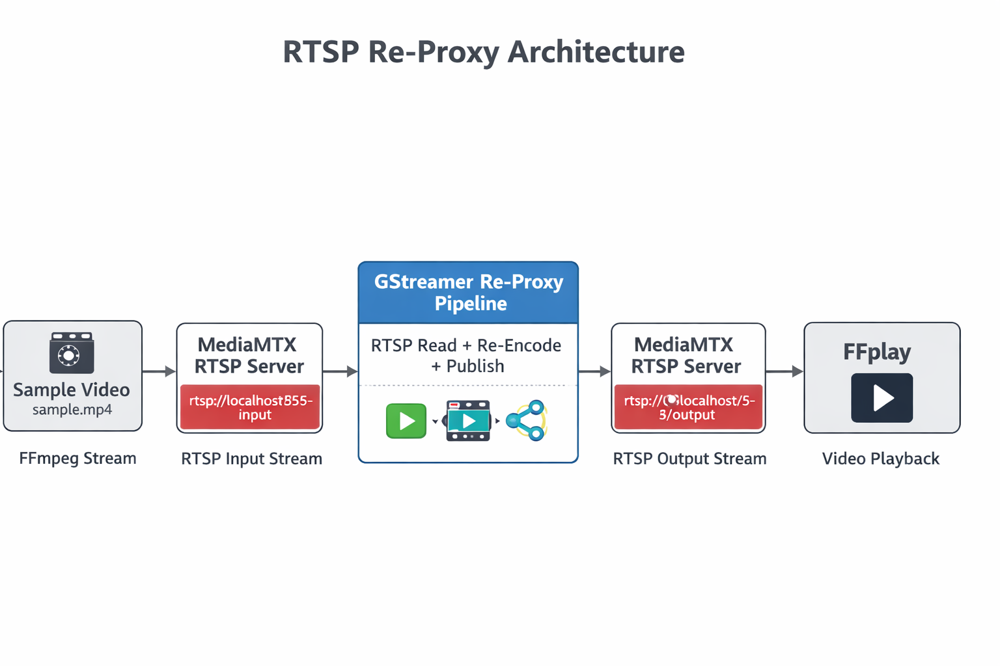

# GStreamer RTSP Re-Proxy Service

A simple RTSP re-proxy service built using **GStreamer**, **MediaMTX**, and **FFmpeg**.  
The system receives an RTSP stream, processes it using a GStreamer pipeline, and republishes it to a new RTSP endpoint.

This project was built as part of the **Wobot Media Server Onboarding Task**.

---

# Architecture

Sample Video
→ FFmpeg Stream Generator
→ MediaMTX RTSP Server (Input)
→ GStreamer Re-Proxy Pipeline
→ MediaMTX RTSP Server (Output)
→ FFplay Client

# Project Structure
gstreamer-rtsp-reproxy
│
├── app
│ └── reproxy.py
│
├── docker
│ └── Dockerfile
│
├── diagrams
│ └── architecture.png
│
├── docker-compose.yml
│
└── README.md

---

# Technologies Used

- **GStreamer** – Media processing pipeline
- **MediaMTX** – RTSP streaming server
- **FFmpeg** – Stream generator
- **FFplay** – Stream viewer
- **Python** – Pipeline launcher
- **Docker** – Containerized service

---

# How It Works

1. **FFmpeg** pushes a video stream to MediaMTX.
2. **MediaMTX** hosts the input RTSP stream.
3. **GStreamer** reads the stream.
4. The pipeline **re-encodes and republishes** the stream.
5. MediaMTX hosts the **new output stream**.
6. **FFplay** plays the output stream.

---

# Setup Instructions

## 1 Start MediaMTX
docker run -it --rm -p 8554:8554 bluenviron/mediamtx

---

## 2 Generate RTSP Stream
ffmpeg -re -stream_loop -1 -i sample.mp4
-c:v libx264
-preset veryfast
-tune zerolatency
-an
-f rtsp
-rtsp_transport tcp
rtsp://localhost:8554/input

---

## 3 Verify Input Stream
ffplay -rtsp_transport tcp rtsp://localhost:8554/input

---

## 4 Run GStreamer Re-Proxy
gst-launch-1.0
rtspsrc location=rtsp://localhost:8554/input protocols=tcp latency=0
! rtph264depay
! decodebin
! x264enc bitrate=2048
! rtspclientsink location=rtsp://localhost:8554/output protocols=tcp

---

## 5 View Output Stream
ffplay -rtsp_transport tcp rtsp://localhost:8554/output

---
## Architecture Diagram

# Docker Setup

Build image:
docker build -t gstreamer-reproxy -f docker/Dockerfile .

Run container:
docker run --network host gstreamer-reproxy

---

# Python Launcher

The Python script launches the GStreamer pipeline:
subprocess.run(pipeline, shell=True)

This allows the pipeline to be easily executed inside a Docker container.

---

# Result

The system successfully:

• receives an RTSP stream  
• processes it using GStreamer  
• republishes the stream to a new RTSP endpoint  
• allows playback using FFplay

---

# Future Improvements

- Add **copy codec mode (no re-encoding)**  
- Add **logging and monitoring**  
- Implement **multi-stream support**

---

# Author

Shashank C
Computer Science Engineering - CSE 2026 
The National Institute of Engineering, Mysore